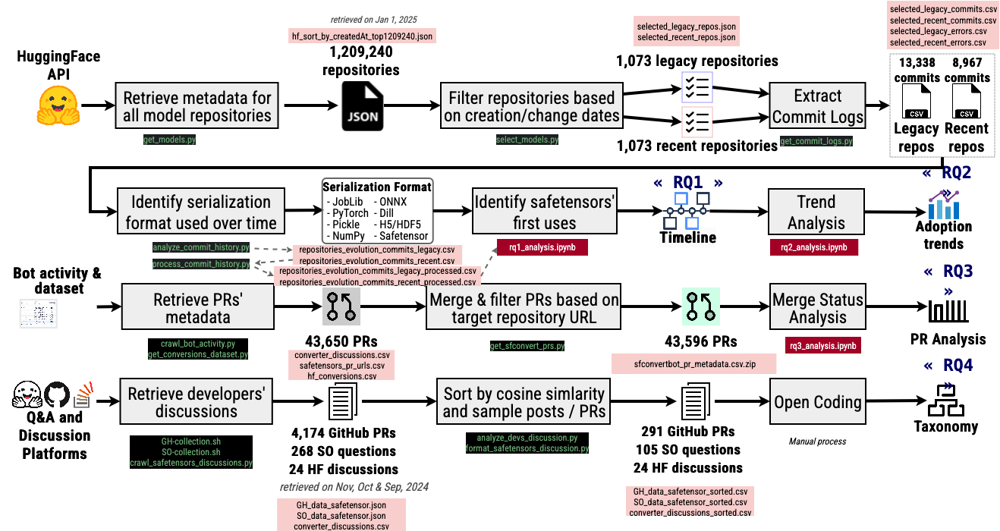

# An Empirical Study of Safetensors' Usage Trends and Developers’ Perceptions

This repository contains the source code for the paper: The Rise of Safetensors: An Empirical Study of Safetensors Usage Trends and Developers' Perceptions. 

## Abstract

Developers are sharing pre-trained Machine Learning (ML) models through a variety of model sharing platforms, such as Hugging Face, in an effort to make ML development more collaborative. To share the models, they must first be serialized. While there are many methods of serialization in Python, most of them are unsafe. To tame this insecurity,  Hugging Face released safetensors as a way to mitigate the threats posed by unsafe serialization formats.  In this context, this paper investigates developer's shifts towards using safetensors on Hugging Face in an effort to understand security practices in the ML development community, as well as how developers react to new methods of serialization. Our results find that more developers are adopting safetensors, and many safetensor adoptions were made by automated conversions of existing models by Hugging Face's conversion tool. We also found, however, that a majority of developers ignore the conversion tool's pull requests, and that while many developers are facing issues with using safetensors, they are eager to learn about and adapt the format.
## Purpose

The purpose of this repository is to provide the source code for the paper: The Rise of Safetensors: An Empirical Study of Safetensors Usage Trends and Developers' Perceptions

## Usage

This project contains five main folders

- **assets**: Folder for storing figures relating to the paper
- **data**: Folder for storing data files.
- **results**: Folder for storing the paper's results.
- **scripts**: Folder for storing scripts used to generate/analyze the results.
  This folder contains the following sub-folders
      - **bot**: scripts relating to getting data about the safetensors convert bot
      - **crc**: scripts to deploy runs to the center for computing resource
      - **github**: scripts relating to getting data from GitHub.
      - **notebooks**: Jupyter notebooks for analyzing the results and generating images
      - **stackoverflow**: scripts relating to getting data from StackOverflow.
- **tests**: Folder for storing unit tests (test the scripts).

The following figure shows the methodology and linked artifacts of this project:

For further information regarding how to run the scripts, please see the README.md under the scripts directory.
